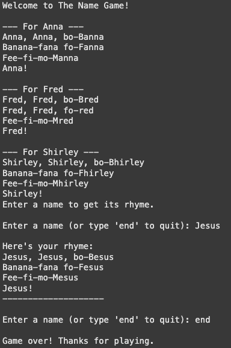

# The Name Game <a href="https://www.python.org/" target="_blank" rel="noreferrer"> **Python** </a>&nbsp;

A simple Python script that generates the rhyme for Shirley Ellis' "The Name Game" song  based on a user-provided name.  

## Features

* Generates the classic Name Game rhyme structure.
* Applies the special variations for names beginning with B, F, or M based on common interpretations.
* Provides an interactive command-line style interface within the notebook's output cell.
* Simple exit command ('end' or empty input) to stop the game.

## 🛠 Usage

Click the badge to open this notebook directly in: 

## How the Rhyme Works

The script uses a simplified rule to determine the rhyming part (the "suffix") of the name needed for the song verses:
* If the name starts with a vowel (a, e, i, o, u), the entire lowercase name is used as the suffix.
* If the name starts with a consonant, the suffix is created by dropping only the first letter of the lowercase name.

*Note: This simple rule works reasonably well for many names but may not perfectly match the phonetic rules for all edge cases or consonant combinations (like 'Sh', 'Th').*

## Example Interaction (in Colab Output)

After running the code cell, the interaction below it will look something like this:

## 📊 Example Output
  

-------------

### 🧑‍💻 Created by [tunjis](https://github.com/tunjis) 

-------------

* 🌍  Based in <a href="https://maps.app.goo.gl/hMxhRX5ptQAAkL7NA/" target="_blank">**London**</a>
* 🖥️  See my portfolio at [Data’s the new oil. I’m the refinery.](https://github.com/tunjis?tab=repositories)
* 📫  Contact me via my [LinkedIn profile](https://linkedin.com/in/justincraciun/)
* 🧠  Learning Data Science
* 🤝  Open to collaborating on interesting projects
* ⚡  AI enthusiast

-------------

### 🛠️ Technical Skills
<a href="https://www.python.org/" target="_blank" rel="noreferrer"> **Python** </a>&nbsp;
<a href="https://www.microsoft.com/en-us/microsoft-365/excel" target="_blank" rel="noreferrer"> **Microsoft Excel** </a>&nbsp;
<a href="https://www.mysql.com/" target="_blank" rel="noreferrer"> **MySQL** </a>&nbsp;
<a href="https://www.tableau.com/" target="_blank" rel="noreferrer"> **Tableau** </a>&nbsp;
<a href="https://powerbi.microsoft.com/" target="_blank" rel="noreferrer"> **Power BI** </a>&nbsp;  

<a href="https://azure.microsoft.com/" target="_blank" rel="noreferrer"> **Microsoft Azure** </a>&nbsp;
<a href="https://cloud.google.com/" target="_blank" rel="noreferrer"> **Google Cloud** </a>&nbsp;
&nbsp;&nbsp;  

-------------

### 🔁 Socials

<a href="https://www.github.com/tunjis/" target="_blank" rel="noreferrer">
  <picture>
    <source media="(prefers-color-scheme: dark)" srcset="https://raw.githubusercontent.com/danielcranney/readme-generator/main/public/icons/socials/github-dark.svg" />
    <source media="(prefers-color-scheme: light)" srcset="https://raw.githubusercontent.com/danielcranney/readme-generator/main/public/icons/socials/github.svg" />
    
  </picture>
</a>&nbsp;
<a href="https://linkedin.com/in/justincraciun/" target="_blank" rel="noreferrer">
  <picture>
    <source media="(prefers-color-scheme: dark)" srcset="https://raw.githubusercontent.com/danielcranney/readme-generator/main/public/icons/socials/linkedin-dark.svg" />
    <source media="(prefers-color-scheme: light)" srcset="https://raw.githubusercontent.com/danielcranney/readme-generator/main/public/icons/socials/linkedin.svg" />
    
  </picture>
</a>&nbsp;&nbsp;  

-------------

### ☕ Support Me

&nbsp;&nbsp;
